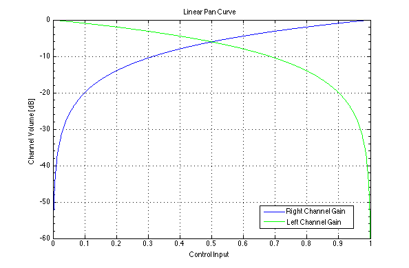
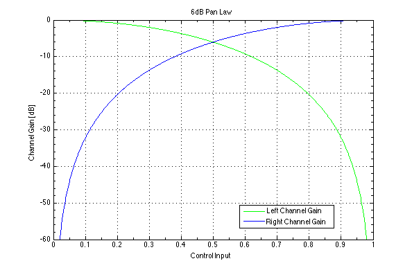

:mod:`PanLaw.h` --- Pan Laws
============================

Pan Laws are volume curves used when panning a signal in order to maintain a
constant perceived loudness from hard left to hard right.  Pan laws generally
provide a reduction in volume to both channels when panned center, to eliminate
a peak in volume when both channels are playing back at the same volume.

Linear Pan Law
^^^^^^^^^^^^^^
A linear Pan law is the simplest pan law, and has each channel at -6dB when
panned center.

.. doxygenfunction:: linear_pan
    :project: FxDSP

3dB Equal Power Pan
^^^^^^^^^^^^^^^^^^^
A circular pan law with each channel at -3dB when panned center.

.. image:: ../img/3dBPan.png
    :align: center

.. doxygenfunction:: equal_power_3dB_pan
    :project: FxDSP

6dB Equal Power Pan
^^^^^^^^^^^^^^^^^^^
A circular pan law with each channel at -6dB when panned center.

.. doxygenfunction:: equal_power_6dB_pan
    :project: FxDSP